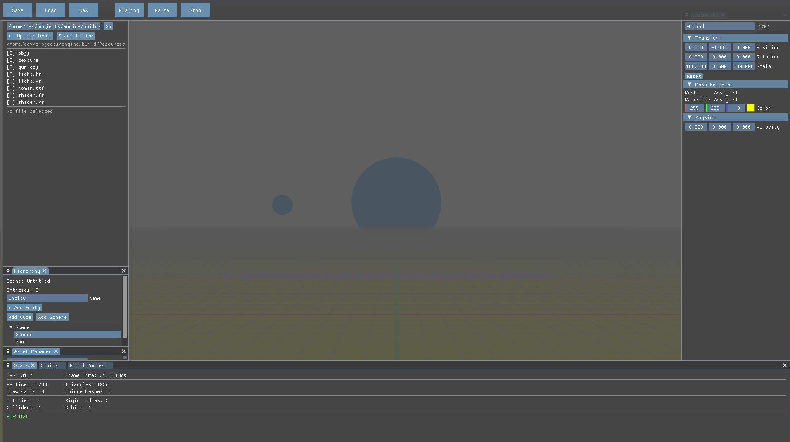

# Physics Simulation Engine (C++ / OpenGL)

## Overview

This project is a custom-built simulation engine developed using C++ and OpenGL. It started as a rendering-focused system and is evolving into a framework for physics-based simulation.

The primary objective is to move from visual rendering toward
a Simulation Engine and Game Engine with a best game ever available to play as mechanical or aerospace engineer.

---

## Main Window


---
## Current Features

* Custom rendering pipeline using OpenGL
* Entity-component style architecture
* Transform system (position, rotation, scale)
* Camera system (view and projection)
* Basic physics system:

  * Mass, velocity, acceleration
  * Force accumulation
  * Gravity (inverse-square law)
* Real-time simulation loop
* ImGui-based debugging interface

---

## Motivation

This project focuses on:

* Modeling physical systems computationally
* Understanding simulation accuracy and stability
* Transitioning from graphics programming to engineering-oriented simulation

---

## Architecture Overview

The engine is organized into modular systems:

* **Scene**: Manages entities and components
* **Transform Component**: Stores spatial data .
* **Renderer**: Handles mesh and shader pipeline .
* **Physics System**: Updates physics and simulation .
* **Camera**: Controls view and projection
* **UI Layer (ImGui)**: Provides debugging tools

---

## Current Limitations

* Uses float precision instead of double
* No advanced numerical methods (e.g., RK4)
* No validation against real-world data
---

## Future Work

* Stable orbital simulation
* Improved numerical integration methods
* Double precision support
* Multi-body gravitational systems
* Expansion toward engineering simulations
* Research-oriented development

---

## Build and Run

```bash
sudo apt update && sudo apt install -y build-essential cmake libglfw3-dev libgl1-mesa-dev xorg-dev libglew-dev

git clone https://github.com/Sanchitpahadi/engine
cd engine

mkdir build
cd build

cmake ..
make
```

---
## Vision
The long-term goal is to build a platform for:

* Physics simulation experimentation
* Bridging graphics and engineering
* Learning computational modeling from first principles
---
## Feedback
This project is under active development. Feedback and discussion are encouraged.

---
## Author
Sanchit Pahadi
---
sanchit.pahadi4u@gmail.com

